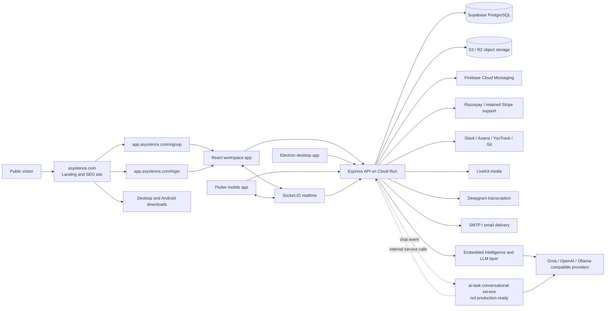

# Asystence End-to-End Project and Architecture Report

**Prepared for:** Management review
**Assessment date:** 30 June 2026
**Assessment type:** Code-backed product, architecture, integration, deployment, and readiness review
**Product name in current public surfaces:** Asystence
**Primary production region in repository configuration:** Google Cloud Run, `asia-south1`

---

## 1. Executive summary

Asystence is no longer a simple task-management application. The current implementation is a multi-tenant intelligent workspace platform that combines project execution, tasks, team communication, Huddles, attendance, leave, performance reviews, OKRs, knowledge management, operational search and memory, automation, enterprise administration, billing, integrations, testing assistance, and workforce intelligence.

The product is delivered through four repositories and one mobile client embedded in the backend repository:

1. `Task-management-landing` — the public marketing, SEO, policy, release-note, and acquisition site at `asystence.com`.
2. `Task-management` — the authenticated React application at `app.asystence.com`, also packaged for desktop through Electron.
3. `Task-management-be` — the Node.js/Express application, Socket.IO realtime server, intelligence engines, background jobs, integration framework, database migrations, and operational tooling.
4. `Task-management-be/mobile/asystence_mobile` — the native Flutter Android/iOS client focused on phone-appropriate workflows.
5. `ai-task` — the separate conversational AI service intended to receive chat events, reason over workspace context, reply as the workspace assistant, create tasks after confirmation, and persist AI provenance. This service is not production-ready or production-certified in its current form.

The system's main strength is product depth combined with shared workspace context. Tasks, chat, attendance, Huddles, reviews, intelligence, and automation are not isolated modules: backend services trigger realtime updates and intelligence recalculation from operational events. This creates a credible foundation for the product's “Intelligent Workspace” positioning.

The main weakness is boundary maturity. The core product builds and the mobile tests pass, but several operational and security boundaries require immediate attention:

- tracked files contain hard-coded credentials or secrets and those values must be rotated;
- several utility, AI, upload, integration-debug, and internal routes are reachable without a consistent authentication boundary;
- the default JWT fallback and permissive CORS behavior are unsafe production fallbacks;
- Cloud Run is configured to scale the backend to many instances, while the deployment workflow does not configure the Redis adapter required for cross-instance Socket.IO delivery;
- the public landing site's pricing, signup promise, and download URLs do not match the actual paid-trial and release contracts;
- the separate AI service has missing package dependencies, duplicate/unwired HTTP entrypoints, broken endpoint contracts, and no automated test gate;
- the authenticated web application builds successfully, but source lint reports 172 errors and 71 warnings, including real React Hook-order defects;
- release metadata is duplicated and currently inconsistent across Flutter, backend defaults, deployment configuration, and landing downloads.

The correct management conclusion is therefore:

> Asystence has a substantial and differentiated product implementation. It should be treated as a growing platform that needs a focused hardening and contract-consolidation phase before expanding production scale or enabling the separate conversational AI service.

---

## 2. Assessment scope and evidence standard

This report was produced from direct inspection of the current source and configuration in all discovered repositories, plus a live read-only inspection of `asystence.com` and `app.asystence.com` on 30 June 2026.

The assessment covered:

- repository structure and recent change history;
- frontend routes, navigation, API usage, session handling, plan gates, and realtime integration;
- landing-page content, SEO structure, pricing, acquisition calls to action, legal pages, release center, and download links;
- backend route mounting, middleware, services, repositories, event observers, Socket.IO, cron jobs, intelligence engines, migrations, deployment, and external services;
- Flutter scope, API contract, secure session storage, Socket.IO, push, update delivery, and Huddle provider structure;
- AI-service event flow, LLM providers, context access, authority checks, task creation, memory, provenance, packaging, and deployment workflow;
- build, syntax, lint, and test evidence that could be gathered safely without changing product behavior.

The labels used in this report mean:

- **Implemented:** a current code path exists and is connected to the runtime entrypoint.
- **Validated locally:** an applicable build, syntax check, or test completed in this assessment.
- **Configured for production:** deployment configuration exists, but this is not proof that the live runtime is healthy.
- **Production-certified:** requires live infrastructure, real-user, security, and operational evidence. This report does not claim full certification.

---

## 3. Product definition

### 3.1 Product category

Asystence is best described as an **intelligent workforce and work-operations platform**, not only a project-management tool.

It serves three connected layers:

1. **Execution layer** — projects, tasks, subtasks, sprints, comments, attachments, tags, links, watchers, votes, saved filters, time tracking, and reports.
2. **Collaboration and people layer** — channels, direct messages, Huddles, notifications, attendance, leave, holidays, reviews, OKRs, profiles, and Wiki.
3. **Management intelligence layer** — dashboards, workspace health, user/project/team scoring, explainability, forecasts, executive summaries, Autopilot, operations search and memory, testing agent, Huddle intelligence, and superadmin growth intelligence.

### 3.2 Primary user groups

| User group | Main value received |
|---|---|
| Contributor | Personal tasks, project work, chat, Huddles, notifications, attendance, leave, reviews, Wiki, and performance visibility |
| Manager | Team delivery visibility, reports, intelligence, Huddle outcomes, task ownership, coaching context, and review workflows |
| Workspace admin | User and plan administration, attendance, migrations, billing, automations, integrations, enterprise controls, workspace search, and memory |
| Superadmin | Workspace lifecycle, plan catalog, payments, backups/recovery, platform settings, and acquisition/growth intelligence |
| Public prospect | Product education, pricing, comparisons, documentation, policies, releases, downloads, signup, and contact paths |

### 3.3 Current product message

The live landing site positions Asystence as an “Intelligent Workspace Platform for Teams.” That message is supported by the breadth of the implementation. The strongest defensible differentiation is not merely “AI”; it is that operational evidence from tasks, projects, communication, attendance, reviews, Huddles, and workspace history can feed one shared management-intelligence layer.

---

## 4. End-to-end system landscape

### 4.1 Repository and deployable inventory

| Surface | Repository/path | Runtime | Deployment intent | Current assessment |
|---|---|---|---|---|
| Public website | `Task-management-landing` | React 18 + Vite | Vercel behind Cloudflare, `asystence.com` | Live and locally buildable |
| Authenticated web app | `Task-management` | React 18 + Vite | Vercel, `app.asystence.com` and workspace subdomains | Live and locally buildable |
| Desktop app | `Task-management/electron` | Electron 41 | GitHub/downloadable desktop artifacts | Packaging exists; public download metadata is stale |
| Backend | `Task-management-be` | Node 20, Express 4, Socket.IO | Cloud Run `asystence-api` | Main production service |
| Native mobile | `Task-management-be/mobile/asystence_mobile` | Flutter | Direct Android APK/R2; iOS source present | Focused mobile app; tests pass |
| Conversational AI | `ai-task` | Node 20, Express 5 | Intended Cloud Run `asystence-ai` | Not ready for production deployment |

---

## 5. Public landing and acquisition experience

### 5.1 What the landing repository does

The landing site is a separate React/Vite application. It is content-led rather than API-driven and includes:

- public homepage and platform narrative;
- feature and solution pages;
- guides, documentation, academy, templates, and comparison pages;
- company, press, media-kit, product-fact, screenshot, integration, and API-overview pages;
- terms, privacy, refund, and cancellation policies;
- public release notes, changelog, and roadmap;
- desktop and Android download links;
- signup, login, pricing, and sales calls to action;
- structured metadata, canonical URLs, JSON-LD, robots.txt, and a generated sitemap.

The build generated a 57-URL sitemap during this assessment. The live homepage loaded without browser console errors in a headless check.

### 5.2 Acquisition flow

The intended customer journey is:

1. A prospect enters through search, a feature page, comparison page, or the homepage.
2. “Start free,” “Start Pro Trial,” and “Get started” direct the prospect to `app.asystence.com/signup`.
3. The authenticated frontend collects workspace name, admin identity, password or Google identity, and explicit trial-billing consent.
4. The backend creates a pending paid-trial checkout.
5. Razorpay verifies the payment method and the backend completes workspace and admin creation.
6. The browser receives access and refresh tokens and redirects to the workspace subdomain.
7. The Cloudflare worker proxies `<workspace>.asystence.com` to the app deployment and sets a workspace-slug cookie.

### 5.3 Public-funnel inconsistencies

The public site currently describes a Basic plan that is “Free forever” and says the free-trial CTA starts on Basic. The actual signup UI says “Card-required trial workspace,” starts a seven-day Pro trial, requires billing consent, performs an INR 1 verification, and authorizes automatic billing after the trial. Production deployment configuration also selects the Pro trial plan and requires payment.

This is a conversion, trust, and compliance risk. Marketing, signup UI, backend plan configuration, and legal language must describe one commercial contract.

The landing download section also contains static artifact URLs that are not synchronized with the backend's Android update contract or current Flutter version. The Windows filenames still contain `0.0.0`, and the Android link uses a generic `app-release.apk` URL rather than the versioned release metadata used by the mobile updater.

### 5.4 Recommended landing-page ownership model

The landing site should remain a separate deployable, but commercial and release facts should not remain hard-coded in `src/App.jsx`. At minimum, the following should come from a shared, versioned source or public API:

- active plans, price, currency, member limits, and trial duration;
- whether a card/payment mandate is required;
- Android version, version code, download URL, checksum, and release notes;
- desktop release version and installer URLs;
- supported platform status.

---

## 6. Authenticated web application

### 6.1 Application structure

The web application is a React 18 single-page application using Vite, React Router, Axios, Socket.IO Client, LiveKit Client, Recharts, Quill, jsPDF, Tailwind, and an internal UI component layer.

The root provider structure is:

1. `BrowserRouter`
2. `ThemeProvider`
3. `AuthProvider`
4. `PlanProvider`
5. `SuperadminAuthProvider`
6. `HuddleProvider`
7. lazy-loaded route tree and global notifications

The application is split into public auth/SLA routes, protected workspace routes, and a separately protected superadmin route tree.

### 6.2 Main application modules

| Area | Main routes/screens |
|---|---|
| Home and execution | Dashboard, Projects, Project Tasks, My Tasks, Notifications |
| Collaboration | Team Chat, direct messages, channels, Huddles, meeting intelligence |
| People operations | Attendance, Leave, Reviews, Goals/OKRs, Profiles, user administration |
| Knowledge and reporting | Wiki, Reports, Executive Summary |
| Intelligence and automation | User Performance, Strategic Intelligence, Workspace Intelligence, AI Hub, AI Features, Autopilot, Testing Agent |
| Administration | Workspace Search and Memory, migrations, integrations, billing, enterprise security/configuration |
| Platform administration | Superadmin workspaces, growth, plans, payments, settings, backups, password recovery |

Static inspection found approximately 415 frontend API-call sites. The heaviest integration surfaces are Project Tasks, Testing Agent, Operations OS, Chat, Dashboard, Migrations, Enterprise, Reviews, Leave, Billing, and Huddle intelligence.

### 6.3 API and session behavior

`src/api.js` is the main Axios contract. It:

- selects the API origin from `VITE_API_URL`;
- attaches the access token and `x-workspace-id` header;
- attaches product-growth context headers;
- coordinates a single refresh request when multiple API calls receive an expired-token response;
- updates stored tokens and wakes waiting calls;
- preconnects to the backend origin.

The route guards enforce authentication, role visibility, and plan visibility in the UI. The backend repeats the important checks, so frontend gating is a user-experience layer rather than the only authorization layer.

### 6.4 Workspace-subdomain model

After authentication, users are redirected from `app.asystence.com` to `<workspace-slug>.asystence.com`. A Cloudflare worker proxies the workspace hostname to the app deployment.

This provides clear workspace identity in the URL, but the current handoff passes both access and refresh tokens in query parameters before the destination removes them and saves them to `localStorage`. This can expose credentials through browser history, edge logs, monitoring, screenshots, referrers, or extensions. A one-time exchange code or secure shared-domain cookie would be safer.

There is also a configuration typo in logout: `AuthContext` reads `VITE_API_BASE_URL`, while the rest of the application uses `VITE_API_URL`. In production this can send the session-revocation request to the localhost fallback even though local browser state is cleared.

### 6.5 Realtime and Huddles

The browser establishes a global authenticated Socket.IO connection so chat, presence, plan changes, notifications, and Huddle invitations work outside the Chat page.

The Huddle client supports:

- mesh WebRTC and LiveKit provider selection;
- workspace-scoped canary configuration and mesh fallback;
- participant/device identity and recovery state;
- call lifecycle tracing;
- LiveKit token prefetch and SDK preloading;
- Deepgram live transcription;
- quality diagnostics;
- transcript, artifact, timeline, ownership, memory-candidate, action-item, and meeting-intelligence experiences.

This is one of the deepest areas of the platform and should be treated as a product subsystem, not a small chat add-on.

### 6.6 Web quality status

- Production build: **passed**.
- Build warning: two generated chunks exceeded 500 kB after minification, including LiveKit and a main application chunk.
- Source lint: **failed with 172 errors and 71 warnings**.
- Material lint issues include conditional React Hook calls, functions accessed before declaration under the active compiler rules, effect-driven render cascades, invalid custom-hook usage, stale dependency arrays, and unused implementation paths.
- The repository has no automated frontend test suite or CI workflow.

The successful build means the application is shippable by Vite; it does not mean the React behavior is regression-safe.

---

## 7. Backend architecture

### 7.1 Runtime model

The backend is a modular monolith built on Node.js 20, Express 4, PostgreSQL through `pg`, and Socket.IO. It is packaged in one Docker image and deployed as one Cloud Run service.

The main runtime entrypoint, `index.js`, is responsible for:

- global HTTP middleware and CORS;
- webhook raw-body handling;
- public and protected route mounting;
- workspace, role, and plan enforcement;
- Socket.IO initialization;
- event-observer registration;
- integration bootstrap;
- background cron and worker startup.

Static scanning found 517 HTTP handler declarations across route, intelligence, AI, and integration code. This is a complexity indicator, not a claim that 517 stable external APIs are documented or supported.

### 7.2 Backend layers

| Layer | Responsibility | Examples |
|---|---|---|
| Route layer | HTTP parsing, middleware, validation, response contract | `routes/*.routes.js`, integration route modules |
| Middleware | Authentication, tenant resolution, roles, plans, audit capture | `middleware/` |
| Service layer | Business logic and cross-module orchestration | `services/`, `autopilot/`, `backup/` |
| Repository/data layer | Raw SQL and reusable data access | `repositories/`, intelligence repositories, service SQL |
| Event layer | Post-change observation and derived signals | `events/`, event bus, observers |
| Realtime layer | Chat, presence, Huddle lifecycle, workspace updates | `realtime/socket.js`, `realtime/huddle/` |
| Intelligence layer | Evidence, scoring, risk, forecasts, snapshots, explainability | `intelligence/` |
| Integration layer | Provider registry, OAuth, webhooks, sync, migrations | `integrations/` |
| Background processing | Attendance, Autopilot, intelligence, reviews, backup, Huddle jobs | `cron/` and worker services |
| Operational tooling | Migration runners, verification, certification, release scripts | root runners and `scripts/` |

### 7.3 Tenant, role, and plan enforcement

The main tenant boundary is the workspace ID embedded in the JWT and resolved by middleware.

The protected request sequence is generally:

1. `authMiddleware` verifies the JWT and normalizes the user and workspace.
2. `requireWorkspaceForUser` loads the workspace, blocks inactive workspaces, and attaches the active billing-plan feature set.
3. `allowRoles` restricts admin/manager-only actions.
4. `requirePlanFeature` enforces module entitlements.
5. Services and SQL queries are expected to include `workspace_id`.

This is a reasonable application-layer tenancy model. Active trials receive the full feature list; after trial, features are loaded from the plan catalog.

### 7.4 Core capability domains

#### Work execution

- projects and project status workflows;
- tasks, ticket sequencing, types, points, assignments, attachments, and history;
- subtasks, comments, tags, task links, watchers, votes, saved filters, templates, and time logs;
- sprints, visibility, lifecycle, burndown, and velocity;
- reports and export surfaces.

#### Communication and Huddles

- public/private channels and DMs;
- channel membership and administration;
- read/unread state, attachments, mentions, reactions, and notification fan-out;
- mesh and LiveKit Huddle lifecycle;
- recovery fences, device identities, participant snapshots, and heartbeats;
- transcription, captions, speaker attribution, transcripts, artifacts, topics, timeline, ownership, risks/blockers, action-task creation, memory promotion, digests, copilot, and retention policy.

#### Workforce operations

- attendance sessions, events, daily aggregation, recalculation, exports, work schedules, geo rules, and activity state;
- leave types, requests, balances, holidays, and approval flows;
- quarterly review-cycle automation, self and manager reviews, reminders, missed-review handling, and summaries;
- goals/OKRs, sprint links, key results, progress, and health assessment.

#### Intelligence and automation

- evidence collection and normalized score primitives;
- user, project, team, attendance, and workspace evaluators;
- risk and signal detection;
- authoritative user/project/team/workspace intelligence records;
- realtime recalculation queues and historical snapshots;
- configurable scoring weights, explainability, user-score trace, and cutover controls;
- dashboard adapters, trend charts, period summaries, and executive narrative generation;
- Autopilot settings, action proposals, approval/rejection, and history;
- Operations OS command center, actions, automations, digests, search, and durable workspace memory;
- browser/testing agent generation, execution control, credentials, reports, and PDF export.

#### Administration and commercial operations

- workspace lifecycle and member administration;
- superadmin session boundary, workspace management, plans, payments, growth analytics, backups, and recovery;
- plan catalog and feature entitlements;
- Razorpay production path with retained Stripe abstractions;
- trial anti-abuse fingerprints and hashed IP logging;
- API keys, webhooks, audit, GDPR, MFA, SAML SSO, and custom branding.

#### Integrations and migration

- provider registry and rehydration;
- Asana OAuth/view/import;
- YouTrack connect/view/import and project-specific webhook support;
- Slack migration;
- Git automation and webhooks;
- external-entity and integration mapping state;
- import history, replacement, and cleanup provenance.

### 7.5 Background jobs

The main process starts:

- attendance aggregation jobs;
- Autopilot jobs;
- weekly and month-close intelligence snapshots;
- quarterly review creation, daily activation/reminders/completion;
- daily backups;
- the Huddle-intelligence polling worker when enabled.

This is operationally convenient, but it couples API replicas and scheduled work. In a horizontally scaled Cloud Run service, every active instance can start the same schedules unless each task is strongly idempotent or externally locked. Long-term, schedules and workers should move to dedicated Cloud Scheduler/Cloud Run Job or queue consumers.

### 7.6 Realtime scaling

The Socket.IO layer has support for a Redis adapter and explicitly diagnoses the risk when Redis is missing. However, the checked deployment workflow does not set a Socket.IO/Redis URL, while Cloud Run allows up to 100 instances.

Without Redis, sockets and room broadcasts are local to one backend instance. At more than one active instance, users connected to different replicas can miss chat, notification, plan-update, presence, and Huddle events. Either Redis must be mandatory before horizontal scaling, or the service must be pinned to one instance with accepted capacity/availability trade-offs.

---

## 8. Data architecture

### 8.1 Database model

PostgreSQL is the system of record. The backend uses raw parameterized SQL through a shared `pg` pool rather than an ORM.

A union scan of `schema_dump.sql` and migration files found 172 unique table names. Because the schema dump and migrations span several architecture generations, this count represents the modeled estate, not a live production table certification.

The data model can be grouped as follows:

| Domain | Representative tables |
|---|---|
| Tenancy and identity | `workspaces`, `workspace_users`, `users`, `user_sessions`, `superadmins`, `superadmin_sessions`, `system_users` |
| Work execution | `projects`, `tasks`, `subtasks`, `sprints`, `comments`, `task_activity_logs`, `task_attachments`, `tags`, `time_logs` |
| Communication | `chat_channels`, `chat_messages`, membership/admin/read tables, keys, `notifications`, push tokens/preferences |
| People operations | attendance tables, leave tables, holidays/schedules, `review_cycles`, `performance_reviews`, OKR tables |
| Intelligence | user/project/team/workspace intelligence, snapshots, recalculation events, scoring configs, executive summaries, narratives, insights, execution signals |
| Operations OS | actions, decisions, automation rules, digest preferences/runs, workspace search history, workspace memory |
| Huddle | sessions, participants, devices, media sessions, quality samples, transcription, transcript segments, artifacts, intelligence jobs, topics, timeline, ownership, risks, memory, digests, recovery, and delivery traces |
| AI service support | `workspace_ai_settings`, `user_preferences`, `ai_memory`, `ai_decision_provenance`, workspace events/context |
| Commercial | billing plans, subscriptions, customers, checkout sessions, webhook events, trial sessions/fingerprints, activation payments |
| Integrations | workspace integrations, integration state/entity state/mappings, migration imports, Git automation |
| Governance | audit logs, GDPR records, API keys, webhooks and deliveries, SSO configs, backup and recovery logs |

### 8.2 Database strengths

- Parameterized SQL is widely used.
- Workspace IDs are present across the major tenant-owned tables.
- The pool has bounded connections, warm minimums, timeouts, keepalive, and one retry for stale connections.
- Many migrations are idempotent and include indexes, foreign keys, uniqueness, provenance, and rollback-aware metadata.
- PostgreSQL DATE parsing is intentionally kept as a date string to avoid timezone drift.
- RLS is enabled across the older table estate to block direct anonymous/authenticated Supabase REST access.

### 8.3 Database risks

- A tracked RLS runner contains a full database connection credential. It must be removed from history and rotated.
- RLS is enabled without application-user policies; the backend's privileged connection bypasses or owns the tables, so tenant safety still depends primarily on application queries.
- There is no single migration framework or migration ledger demonstrated across all runners; many root-level scripts must be coordinated manually.
- `rejectUnauthorized: false` is used for database TLS.
- Some older migrations show historical type differences for `workspace_id` and attachment records.
- Direct SQL is spread across repositories and large services, making complete tenant-scope auditing harder.

---

## 9. Intelligence architecture

### 9.1 Embedded intelligence is already the primary AI platform

The backend contains a mature intelligence subsystem independent of `ai-task`. It has four important stages:

1. **Evidence collection** — reads tasks, projects, attendance, collaboration, reviews, and workspace evidence.
2. **Deterministic evaluation** — normalizes evidence and computes dimension, entity, risk, confidence, and overall scores.
3. **Persistence and history** — stores authoritative intelligence records, recalculation events, and snapshots.
4. **Presentation and narrative** — supplies dashboards, explainability, forecasts, executive summaries, recommendations, and Ask AI surfaces.

Operational writes in task, sprint, attendance, time-tracking, and related services enqueue impacted intelligence recalculation and emit workspace intelligence updates.

### 9.2 Why this architecture is valuable

The deterministic scoring layer and the LLM narrative layer are separated. This allows the product to use an LLM to explain or summarize evidence without making the LLM the sole source of a score. The newer certification and score-trace services also improve auditability by exposing evidence, normalized inputs, weight contributions, formula, confidence, time range, and final rounding.

### 9.3 Embedded LLM providers

The backend includes provider switching for Ollama/local, OpenAI, Groq, Grok, and Hugging Face-style endpoints, with Groq configured in the deployment workflow. LLM use appears in executive summaries, natural-language task creation, testing assistance, Huddle intelligence, and related narratives.

The management distinction should be clear:

- **Embedded intelligence:** already part of the backend and product.
- **Conversational AI service (`ai-task`):** an additional chat-agent service that is not yet ready for production.

---

## 10. Conversational AI service (`ai-task`)

### 10.1 Intended responsibility

The separate AI service is designed to act as a workspace conversational agent. Its intended event flow is:

1. A human chat message is committed in the backend.
2. If workspace settings and channel/user rules allow AI, the backend posts a `chat:new-message` event to the AI service using a shared secret.
3. The AI service checks workspace AI settings and user opt-in.
4. It loads workspace history, user/work context, association rules, conversation memory, and decision history as needed.
5. It detects task or report intent.
6. For task creation, it asks for missing fields and explicit confirmation, resolves project/assignee, and calls a protected internal backend endpoint.
7. For normal conversation or away-user auto-reply, it calls the configured LLM provider.
8. It writes the reply through the backend, not directly to chat tables.
9. It stores business-safe decision provenance and conversation state.

This is a sensible service boundary because conversational generation can fail or scale independently without blocking the main chat write transaction.

### 10.2 Positive design elements

- AI event emission occurs after the chat transaction commits.
- User auto-reply defaults to disabled when preference cannot be confirmed.
- Task creation asks for confirmation before mutation.
- User role and workspace membership are checked.
- AI messages are written through an internal backend route and broadcast normally.
- Conversation memory has an explicit clear path when a user disables auto-reply.
- Decision provenance is recorded separately from the response.
- Ollama, Groq, and OpenAI provider paths are modeled.
- The service generally catches generation failures so it does not crash the main backend.

### 10.3 Production blockers

| Blocker | Evidence | Effect |
|---|---|---|
| Missing runtime dependency | `src/db.js` imports `pg`, but `pg` is absent from `package.json` and `package-lock.json` | A clean Docker `npm ci` image cannot resolve the database driver. Local startup is falsely masked by a user-level `pg` installation outside the repository. |
| Two disconnected Express applications | `src/app.js` mounts `/ai/health` and `/ai/chat/preview`; `npm start` runs `src/index.js`, which creates a different app | The documented health/preview routes are not part of the actual runtime. |
| Broken explain endpoint | `src/index.js` calls `explainAIMessage` without importing it | `GET /explain/:messageId` fails at runtime. |
| Dead context contract | `src/context/buildContext.js` calls three backend endpoints that do not exist | The preview/context route cannot work as written. |
| Environment-name mismatch | Context code expects `MAIN_BACKEND_URL`; deployment sets `BACKEND_BASE_URL` | Even if the endpoints existed, the configured deployment would not reach them. |
| Inconsistent service-auth headers | Bearer token, `x-ai-service-token`, and `x-ai-secret` patterns coexist | Security behavior depends on which dead/live path is used. |
| Database TLS config ignored | AI `db.js` ignores `DATABASE_URL` and `DB_SSL` even though deployment sets both | Production database connection may fail or be less controlled. |
| Secret leakage on auth failure | The live entrypoint logs both received and expected secret values on mismatch | A single invalid request can write the service credential to logs. |
| Public Cloud Run IAM | Workflow first deploys private, then grants `allUsers` invoker | Network access becomes public; application shared-secret security becomes the only boundary. |
| No test or quality gate | No test files, lint script, typecheck, startup smoke test, or CI gate | Contract and packaging defects can reach deployment directly. |

### 10.4 AI deployment recommendation

Do not enable production chat events until the service passes a clean-container certification bundle:

1. one runtime entrypoint and one Express app;
2. complete locked dependencies;
3. `/healthz` and `/readyz` on the live app;
4. one service-auth contract;
5. one backend base URL variable;
6. no direct secret logging;
7. private Cloud Run invocation using service identity or signed identity tokens;
8. database access removed where backend APIs can provide scoped data, or fully secured if retained;
9. contract tests for every backend call;
10. end-to-end tests for opt-in, normal reply, away reply, confirmation, task creation, memory clear, provenance, timeout, and duplicate-event handling;
11. feature-flagged backend emission with workspace allowlist and immediate rollback.

---

## 11. Native Flutter client

### 11.1 Scope

The Flutter app is intentionally smaller than the web application. It focuses on workflows that make sense on a phone:

- authentication, MFA, refresh, logout, and forgot password;
- dashboard;
- projects and project administration for authorized roles;
- task creation, editing, assignment, status, comments, subtasks, history, and attachments;
- personal tasks;
- channels, DMs, attachments, unread state, realtime chat, and Huddles;
- notifications and push actions;
- leave and approval flows;
- profile, attendance actions, notification preferences, and password change.

Desktop-heavy administration remains web-only: testing agent, integrations/migrations, billing checkout, enterprise configuration, large intelligence consoles, raw reports, and superadmin.

### 11.2 Mobile architecture

- tokens are stored using secure storage;
- REST calls reuse the backend's bearer and workspace-header contract;
- Socket.IO provides realtime chat/presence/Huddle events;
- Firebase Messaging registers through the backend push API;
- app links and notification intents route into project, task, and chat screens;
- the app can use mesh or LiveKit Huddle providers and includes mobile live transcription support;
- the updater reads the public `GET /app-version` backend contract.

### 11.3 Current validation and drift

- Flutter tests: **13 passed**.
- Flutter analysis: not completed in this assessment because Windows tooling stalled on generated iOS/plugin state; this is not counted as an analysis pass.
- `pubspec.yaml` is at `1.0.25+26`, but `AppConfig` fallback, backend route defaults, backend workflow release variables, and landing download URLs contain older values.
- The Flutter theme's default orange also differs from the web's centralized brand orange.

Mobile release facts need one source of truth that updates the backend contract and landing downloads automatically.

---

## 12. External services and integration map

| External dependency | Purpose | Main owner |
|---|---|---|
| Supabase PostgreSQL | Primary relational data store | Backend |
| Cloud Run / Cloud Build / GCR | Backend and intended AI compute/deployment | Backend and AI workflows |
| Vercel | Landing and authenticated web hosting | Landing and frontend |
| Cloudflare | DNS/CDN and workspace-subdomain proxy | Platform edge |
| AWS S3 / Cloudflare R2-compatible storage | Uploads, backup artifacts, Android APK distribution | Backend |
| Firebase Cloud Messaging | Web/mobile push notifications | Backend and Flutter |
| LiveKit | Selectable SFU media path for Huddles | Backend, web, mobile |
| Deepgram | Live speech-to-text and captions | Backend, web, mobile |
| Razorpay | Current production subscription/trial path | Backend and signup/billing UI |
| Stripe | Retained billing abstractions and older configuration | Backend |
| Google OAuth | Login/signup identity | Backend and web |
| SAML identity providers | Enterprise SSO | Backend and enterprise UI |
| SMTP/email provider | Password recovery, review notices, operational emails | Backend |
| Slack, Asana, YouTrack, Git providers | Migration, synchronization, OAuth, and automation | Integration subsystem |
| Groq/OpenAI/Ollama-compatible LLMs | Narratives, assistant responses, parsing, and generation | Backend and AI service |

---

## 13. Detailed end-to-end flows

### 13.1 Signup, billing, and workspace creation

1. Landing CTA opens `/signup` on the app domain.
2. React collects workspace/admin information and trial consent.
3. `POST /auth/signup/workspace` asks the backend to prepare the trial.
4. Backend validates eligibility and anti-abuse conditions, loads the configured trial plan, and creates a pending checkout.
5. Razorpay returns subscription or order information.
6. The frontend opens Razorpay Checkout.
7. The frontend posts signed payment/subscription fields to `/auth/signup/workspace/complete/razorpay`.
8. Backend verifies the signature and provider state, creates the workspace/admin/session/subscription records, and initiates the verification refund.
9. Frontend stores credentials and redirects to the workspace subdomain.
10. `PlanProvider` loads `/workspaces/my-plan`; UI and backend routes enforce features.

### 13.2 Authenticated API request

1. Axios reads the stored access token and user workspace.
2. It attaches `Authorization`, `x-workspace-id`, and growth headers.
3. JWT middleware verifies identity.
4. Workspace middleware loads active tenant and plan features.
5. Role/feature middleware applies route-specific policy.
6. Service/repository executes workspace-scoped SQL.
7. Response returns to the client.
8. On expiry, one refresh request rotates access/refresh credentials and retries queued calls.

### 13.3 Task mutation and intelligence propagation

1. Web or mobile submits a task change.
2. Task route validates request and workspace context.
3. Task service writes PostgreSQL records and activity history.
4. Socket.IO emits task/workspace updates where applicable.
5. Event observers store operational evidence and execution signals.
6. Intelligence recalculation is queued asynchronously for impacted users/projects/workspace.
7. Updated intelligence is persisted and a workspace-intelligence event is emitted.
8. Dashboard and intelligence screens read the new authoritative state.

### 13.4 Chat and conversational AI

1. Client sends a message by HTTP or Socket.IO.
2. Backend validates channel membership, stores the message, and emits realtime delivery.
3. Backend checks whether AI is permitted for the workspace/channel/user context.
4. After commit, backend emits a signed AI event.
5. AI service checks workspace settings and user opt-in.
6. AI resolves authority, context, intent, memory, and any task/report workflow.
7. AI generates or executes only the confirmed action.
8. AI posts the reply to `/internal/ai/reply`.
9. Backend stores it as the workspace system user and emits it through normal chat delivery.
10. AI writes provenance and conversation state.

This flow is architecturally sound but should remain disabled until the AI blockers and internal-route security issues are closed.

### 13.5 Huddle and meeting intelligence

1. User starts or joins a Huddle through Socket.IO.
2. Backend authorizes workspace/channel scope and locks the selected provider.
3. Mesh path exchanges WebRTC signaling through Socket.IO; LiveKit path obtains room/token contracts from the backend.
4. Client publishes audio/video and reports lifecycle and quality evidence.
5. Deepgram transcription is authorized and streamed when enabled.
6. Captions and transcript segments are persisted.
7. Finalization queues meeting-intelligence jobs.
8. Workers generate or update artifacts, topics, decisions, actions, risks, ownership, timeline, digests, and memory candidates.
9. Users review, correct, approve, reject, promote, revoke, or convert outputs to tasks in the Huddle intelligence screen.

### 13.6 Superadmin plan change

1. Superadmin edits a billing plan or workspace subscription.
2. Backend updates the plan/workspace records.
3. Socket.IO emits `workspace:plan_updated` to the tenant room.
4. Web clients re-fetch `/workspaces/my-plan`.
5. Frontend navigation and backend feature middleware immediately reflect the new entitlements.

---

## 14. Security assessment

### 14.1 Existing strengths

- JWT authentication and refresh-session support exist.
- Superadmin has a separate token type and server-side session-revocation check.
- Workspace middleware blocks inactive tenants and superadmin use of tenant routes.
- Role and plan gates exist on both frontend and backend.
- Payment webhooks retain raw request bodies for signature verification.
- Audit middleware includes recursive sensitive-field redaction.
- User AI auto-reply requires explicit per-user preference.
- Trial IPs are hashed rather than stored directly.
- RLS blocks direct anonymous/authenticated Supabase REST access.
- Vercel app responses include frame, content-type, and referrer headers.

### 14.2 Immediate security findings

1. **Tracked credentials:** database and realtime/service credentials are embedded in tracked scripts/workflows. Remove, purge where practical, and rotate.
2. **Unsafe JWT fallback:** normal auth accepts a hard-coded fallback if `JWT_SECRET` is absent. Production should fail startup instead.
3. **Permissive CORS:** the callback currently accepts every origin even when it is not in the allowlist.
4. **Unauthenticated AI routes:** `/ai/system-user/:workspaceId` and `/ai/message` are mounted publicly and do not enforce service authentication.
5. **Inconsistent internal-route protection:** the `/internal` router is mounted publicly; several endpoints protect themselves, but AI explain/provenance and project-report paths do not apply a consistent internal or user-auth middleware.
6. **Public integration diagnostics:** `/integration-debug/events` and `/integration-debug/state` expose cross-workspace information without authentication or workspace filtering.
7. **Public upload routes:** upload endpoints accept up to 100 MB and are mounted before global auth without per-route authentication.
8. **AI secret logging:** the AI service logs expected and received shared-secret values on mismatch.
9. **Token transport/storage:** access and refresh tokens are passed through query parameters and stored in `localStorage`.
10. **Missing backend hardening middleware:** Helmet is installed but not applied; ordinary auth endpoints do not show a common distributed rate limiter.

These should be addressed before marketing the platform as enterprise-secure or enabling additional tenants at scale.

---

## 15. Deployment and operations

### 15.1 Backend

The backend Docker image:

- uses Node 20 slim;
- installs production dependencies;
- installs Playwright Chromium and system dependencies for the Testing Agent;
- starts `node index.js` on port 3000.

The Cloud Run workflow deploys on every push to `main`, allows unauthenticated HTTP invocation, sets one minimum instance and up to 100 maximum instances, then materializes and verifies dashboard intelligence history.

Important operational observations:

- there is no test/lint/security stage before deployment;
- the workflow contains a very large inline environment-variable command, making drift and accidental disclosure more likely;
- environment and release metadata are committed into the workflow rather than managed through a structured release/config layer;
- no Redis URL is present even though multiple backend instances are permitted;
- no dedicated `/health` endpoint is mounted, while `railway.json` expects `/health`;
- API, realtime, cron jobs, Huddle worker, backup scheduler, and browser-testing runtime share one process/image;
- Playwright makes every API instance heavier even when no browser test is running.

### 15.2 Frontend and landing

Both are Vite SPA deployments with Vercel rewrites to `index.html`.

The authenticated app has basic security response headers. The landing deployment does not define equivalent headers in its `vercel.json`.

Neither repository contains a CI workflow or automated test suite. Deployment appears to rely on Vercel's repository integration and successful build.

### 15.3 AI service

The workflow intends to build a Node 20 image and deploy `asystence-ai` on port 8080. It first specifies private invocation and then explicitly grants public invocation. There is no build test, smoke test, health check, readiness check, or post-deploy functional check.

### 15.4 Backups and recovery

The backend includes daily backup scheduling, backup logs, optional object-storage upload, pruning, superadmin views, recovery jobs, dry-run recovery, and a documented recovery runbook. This is a strong foundation.

It still needs regularly recorded restoration evidence. A successful backup file is not the same as a successful tenant restore under time pressure.

---

## 16. Quality and validation evidence

| Check | Result | Interpretation |
|---|---|---|
| Backend JavaScript syntax check | 328 files passed | Current inspected backend modules parse successfully |
| Backend automated tests | One conventional Node test file plus many domain verification scripts | Strong domain-specific checks in intelligence/Huddle, but no unified CI test gate |
| Authenticated frontend production build | Passed | Current React app bundles successfully |
| Authenticated frontend source lint | Failed: 172 errors, 71 warnings | Material technical debt and regression risk remain |
| Landing production build | Passed | Sitemap and production bundle generate successfully |
| Landing live browser load | Passed without console errors | Current public homepage renders successfully |
| Flutter tests | 13 passed | Key API, ICE fallback, navigation intent, and package checks pass |
| Flutter analysis | Not completed due generated iOS/plugin tooling stall | Must be rerun in a clean, serialized mobile environment |
| AI JavaScript syntax check | 46 files passed | Files parse, but this does not validate module/package/runtime contracts |
| AI clean dependency check | Failed conceptually: `pg` absent from manifest/lock | Clean Docker runtime is not deployable as written |
| AI automated tests | None | Production behavior is unverified |

---

## 17. Risk register

| ID | Priority | Risk | Business/technical impact | Recommended action |
|---|---|---|---|---|
| R1 | Critical | Credentials and secrets are tracked in source/configuration | Database, media, and internal-service compromise | Rotate immediately, move to Secret Manager, purge from history where practical, add secret scanning |
| R2 | Critical | Public or inconsistently protected utility/internal routes | Cross-tenant data exposure, unauthorized writes, storage abuse | Add explicit route classifications and deny-by-default auth at router boundaries |
| R3 | Critical | Backend can scale without distributed Socket.IO | Missed chat, notification, presence, and Huddle events across replicas | Configure Redis and require it when max instances > 1, or cap to one instance |
| R4 | High | AI service cannot be reproduced from its locked package manifest | Failed deployment or environment-dependent runtime | Add `pg` or remove direct DB access; test clean Docker startup |
| R5 | High | AI service entrypoint/contracts are split and partially dead | False health, broken explain/context endpoints, operational confusion | Consolidate one app/entrypoint and one documented API contract |
| R6 | High | Landing commercial promise differs from actual signup | Customer trust, refund, chargeback, and compliance risk | Align pricing, trial, verification, and cancellation copy with live backend plan data |
| R7 | High | Query-string token handoff and localStorage refresh token | Credential leakage and XSS blast radius | Use one-time exchange code and secure HttpOnly cookie/session model |
| R8 | High | No deployment quality gate | Known lint/contract defects can ship on push | Add build, lint, tests, secret scan, dependency scan, and smoke tests before deploy |
| R9 | High | Cron/workers run inside horizontally scaled API | Duplicate work, race conditions, noisy cost, inconsistent schedules | Move schedules/workers to Cloud Scheduler, jobs, or queue consumers with locks |
| R10 | Medium | Release/version facts are duplicated and stale | Users receive wrong downloads or no update prompt | Create release manifest and automate landing/backend/mobile synchronization |
| R11 | Medium | Web source has Hook-order and effect defects | Runtime regressions, render instability, harder refactoring | Fix correctness-class lint first; then make source lint a CI gate |
| R12 | Medium | Backend is a very broad monolith | Slow releases and high coupling | Keep modular-monolith approach but separate worker/browser/AI operational units |
| R13 | Medium | API contracts are not centrally typed/documented | Frontend/backend drift and dead endpoints | Generate OpenAPI and typed clients; add consumer-driven contract tests |
| R14 | Medium | Branding and older architecture docs drift from current implementation | Management and customer confusion | Archive or replace stale system diagrams and centralize product/release facts |
| R15 | Medium | Backup success is not restoration certification | Recovery may fail when urgently needed | Schedule evidence-backed restore drills with RTO/RPO records |

---

## 18. Recommended roadmap

### Phase 0 — Immediate containment: 0–3 days

1. Rotate every credential found in tracked files, including database, internal AI, and media/TURN credentials.
2. Remove hard-coded values and adopt Google Secret Manager/GitHub encrypted secrets only.
3. Disable or protect public upload, integration-debug, AI, and unprotected internal routes.
4. Make missing `JWT_SECRET` a startup failure in production.
5. Replace allow-all CORS with explicit app, landing if needed, workspace wildcard validation, and local-development origins.
6. Keep backend at one Cloud Run instance until Redis-backed Socket.IO is confirmed, or configure Redis immediately.
7. Keep backend-to-`ai-task` chat emission disabled.
8. Correct landing copy so prospects see the actual paid-trial/payment mandate before signup.

### Phase 1 — Reproducible delivery: 1–2 weeks

1. Add CI to every repository.
2. Backend gate: syntax, focused tests, secret scan, dependency scan, migration safety, Docker smoke start.
3. Frontend gate: source-only lint, production build, route smoke tests, auth/plan critical-flow tests.
4. Landing gate: build, sitemap validation, broken-link/download check, pricing-contract check, accessibility smoke.
5. Mobile gate: serialized `flutter analyze`, tests, and Android build metadata verification.
6. AI gate: dependency lock, unit tests, contract tests, Docker build, health/readiness smoke.
7. Add a real `/healthz` and `/readyz` contract to backend and AI.
8. Move release variables out of the deployment workflow into a release manifest/tool.

### Phase 2 — Contract and security consolidation: 2–4 weeks

1. Define public, authenticated-user, superadmin, webhook, and internal-service routers explicitly.
2. Apply shared authentication middleware at each router boundary.
3. Replace shared static AI secret with private Cloud Run service-to-service identity.
4. Replace query-token subdomain handoff with one-time exchange.
5. Apply Helmet/CSP and distributed rate limiting.
6. Create an OpenAPI specification from current routes and generate web/mobile clients for critical domains.
7. Add tenant-scope tests for all data-bearing routes and direct service SQL.
8. Configure Redis as required for multi-instance realtime.

### Phase 3 — AI canary readiness: 4–6 weeks

1. Consolidate `ai-task` entrypoints and environment variables.
2. Decide whether AI may access PostgreSQL directly. Prefer scoped backend APIs unless direct access has a strong performance reason.
3. Implement idempotency for duplicate chat events and task-execution requests.
4. Add timeouts, retries, circuit breaking, dead-letter handling, and provider fallback metrics.
5. Add prompt/version provenance, privacy retention, opt-in audit, and per-workspace kill switch.
6. Run local and staging certification using seeded workspaces.
7. Enable one internal workspace through an allowlist.
8. Compare response accuracy, task-action safety, latency, cost, and user override behavior before expansion.

### Phase 4 — Platform scalability and operating model: 1–3 months

1. Separate API, scheduled jobs, Huddle intelligence worker, backups, and browser testing into operationally independent deployables.
2. Add centralized logs, metrics, tracing, error tracking, and SLO dashboards.
3. Introduce a migration ledger and automated forward/backward compatibility checks.
4. Establish product analytics from landing → signup → activation → retained feature use.
5. Make plan, pricing, downloads, and release notes API-driven.
6. Perform quarterly restore drills, tenant-isolation tests, and Huddle real-device certification.
7. Reduce frontend bundle weight and correctness-class lint debt.

---

## 19. Recommended management decisions

Management should approve the following decisions explicitly:

1. **Product category:** position Asystence as an intelligent workspace/work-operations platform, not only a task manager.
2. **Commercial truth source:** select one authoritative plan and release catalog shared by landing, signup, billing, mobile updater, and downloads.
3. **AI boundary:** keep deterministic intelligence in the backend; treat conversational AI as an independently gated service.
4. **Realtime scale:** fund Redis-backed distributed Socket.IO before enabling multi-instance scaling.
5. **Security sprint:** prioritize boundary hardening and secret rotation ahead of new feature work.
6. **Deployment standard:** no repository should deploy on push without build/test/security gates.
7. **Architecture direction:** retain the modular monolith for core business domains now, while extracting operationally different workloads rather than prematurely splitting every module into a microservice.

---

## 20. Manager-ready summary

Asystence already has the implementation depth to support a strong platform story. It connects the daily work record—projects, tasks, chat, attendance, Huddles, reviews, goals, and knowledge—to management intelligence and automation. The public website, authenticated application, backend, native mobile client, and embedded intelligence are real and active codebases, not presentation-only concepts.

The next priority should not be adding another wide feature area. It should be making the current platform reproducible, secure, contract-driven, observable, and commercially consistent. The separate conversational AI service is a promising extension, but it should enter production only through a narrow internal canary after its packaging, authentication, context contracts, safety tests, and rollback controls are complete.

If the immediate critical risks are closed and the proposed delivery gates are adopted, the current architecture can support controlled growth without requiring a full rewrite.

---

## Appendix A — Key source evidence

| Topic | Primary source paths |
|---|---|
| Backend runtime and route mounting | `index.js` |
| Authentication and tenancy | `middleware/auth.middleware.js`, `middleware/workspace.middleware.js`, `middleware/role.middleware.js`, `middleware/plan.middleware.js` |
| Database pool | `db.js` |
| Realtime and Redis adapter | `realtime/socket.js`, `realtime/huddle/` |
| Task/intelligence event connection | `services/task.service.js`, `services/sprint.service.js`, `intelligence/realtime/recalculation.service.js` |
| Intelligence core | `intelligence/engine/`, `intelligence/evaluators/`, `intelligence/repositories/`, `intelligence/analytics/` |
| Huddle platform | `routes/huddle*.routes.js`, `services/huddle*.service.js`, `services/liveKitRoom.service.js` |
| Billing and trial signup | `routes/auth.routes.js`, `routes/payments.routes.js`, `services/payments.service.js` |
| Integrations | `integrations/`, `routes/integration.routes.js`, `routes/migrationHistory.routes.js` |
| Backend deployment | `Dockerfile`, `.github/workflows/deploy.yml` |
| Web route tree | `Task-management/src/App.jsx` |
| Web API/session layer | `Task-management/src/api.js`, `Task-management/src/context/AuthContext.jsx` |
| Web realtime/Huddle | `Task-management/src/socket.js`, `Task-management/src/huddle/`, `Task-management/src/context/HuddleContext.jsx` |
| Landing | `Task-management-landing/src/App.jsx`, `marketingPages.js`, `contentPages.js`, `releaseData.js`, `seo.js` |
| Flutter | `mobile/asystence_mobile/lib/`, `pubspec.yaml`, `README.md` |
| Android update contract | `routes/appVersion.routes.js`, `mobile/asystence_mobile/lib/src/core/app_update_service.dart` |
| AI runtime | `ai-task/src/index.js` |
| AI responder | `ai-task/src/agents/responder.js`, `src/autoReply/`, `src/services/llmResponder.js` |
| AI/backend bridge | `services/chat.service.js`, `routes/internal.js`, `routes/internalTasks.js`, `ai-task/src/services/backendApi.js` |
| AI deployment | `ai-task/Dockerfile`, `ai-task/.github/workflows/deploy.yml` |

## Appendix B — Important documentation correction

The existing `SYSTEM_DIAGRAM.md` describes an older architecture in which one React/Capacitor codebase provides mobile delivery and the product is named Proxima. The current repository contains a native Flutter app, current public branding is Asystence, and Huddle/enterprise-intelligence implementation has advanced substantially since that document's April snapshot.

This report should be used as the current high-level architecture baseline until a new generated system diagram and API catalog are adopted.

---

## Appendix C - Adaptive Agent Runtime implementation addendum

After this architecture assessment, an implementation pass added the first version of the **Adaptive Agent Runtime** as a new platform layer above the existing Asystence product.

The implementation is documented separately in:

- `docs/ASYSTENCE_ADAPTIVE_AGENT_RUNTIME_IMPLEMENTATION_2026-06-30.md`
- `docs/ASYSTENCE_PRODUCTION_ROLLOUT_VALIDATION_CERTIFICATION_2026-06-30.md`

In short, the new layer adds:

- versioned operational events;
- asynchronous adaptive event queueing;
- context composition from existing platform data;
- a capability registry for AI and non-AI platform actions;
- deterministic explainable reasoning;
- approval-aware execution through existing services;
- workflow definitions using a simple `WHEN -> IF -> THEN -> WAIT -> APPROVAL -> END` model;
- learning signals, preference profiles, and prediction evaluation;
- observability for runtime runs and capability invocations;
- contextual web recommendations on Dashboard and Project Tasks;
- AI-service boundary hardening;
- internal-route and secret-handling hardening.

The implementation is intentionally additive and rollback-safe. It does not replace existing project, task, Huddle, intelligence, mobile, desktop, billing, integration, or superadmin behavior.
